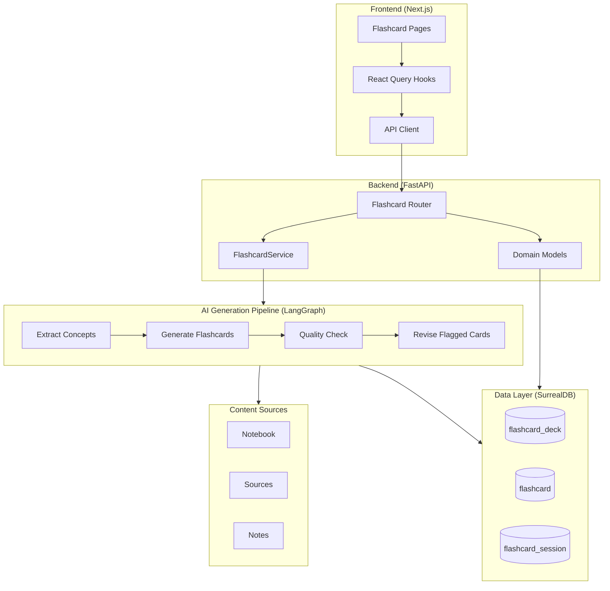
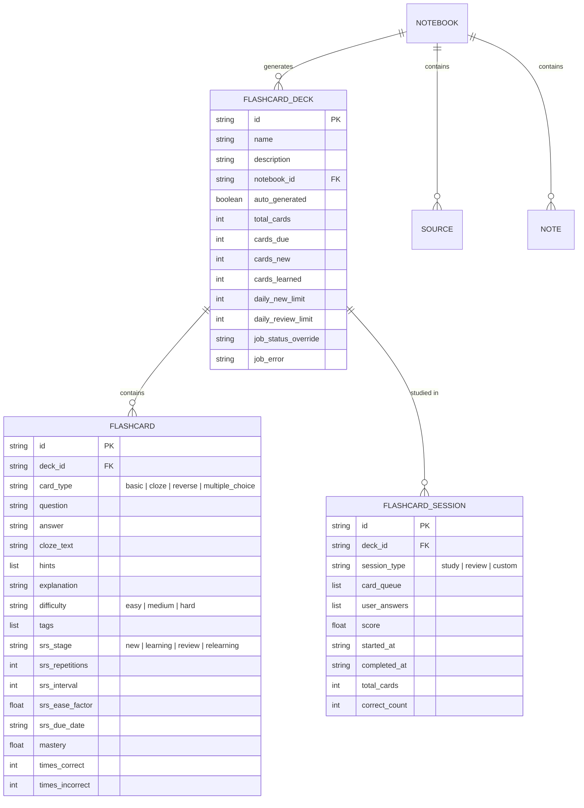
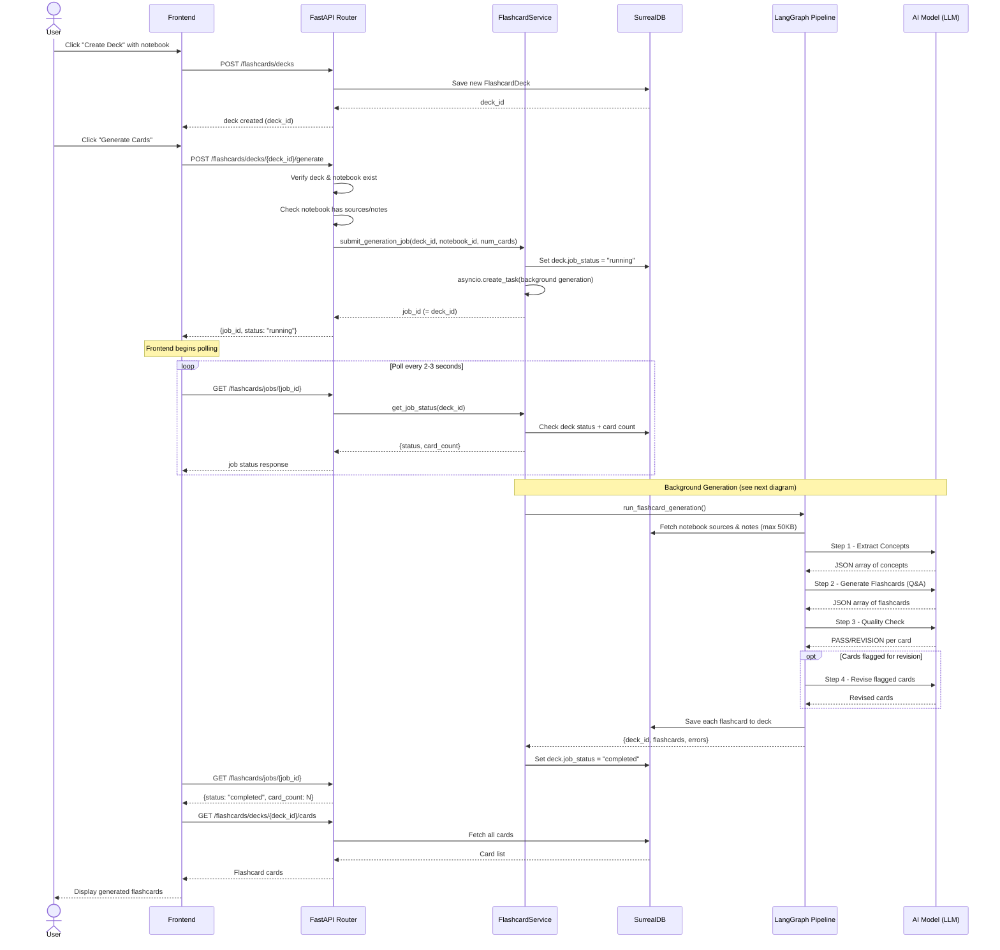
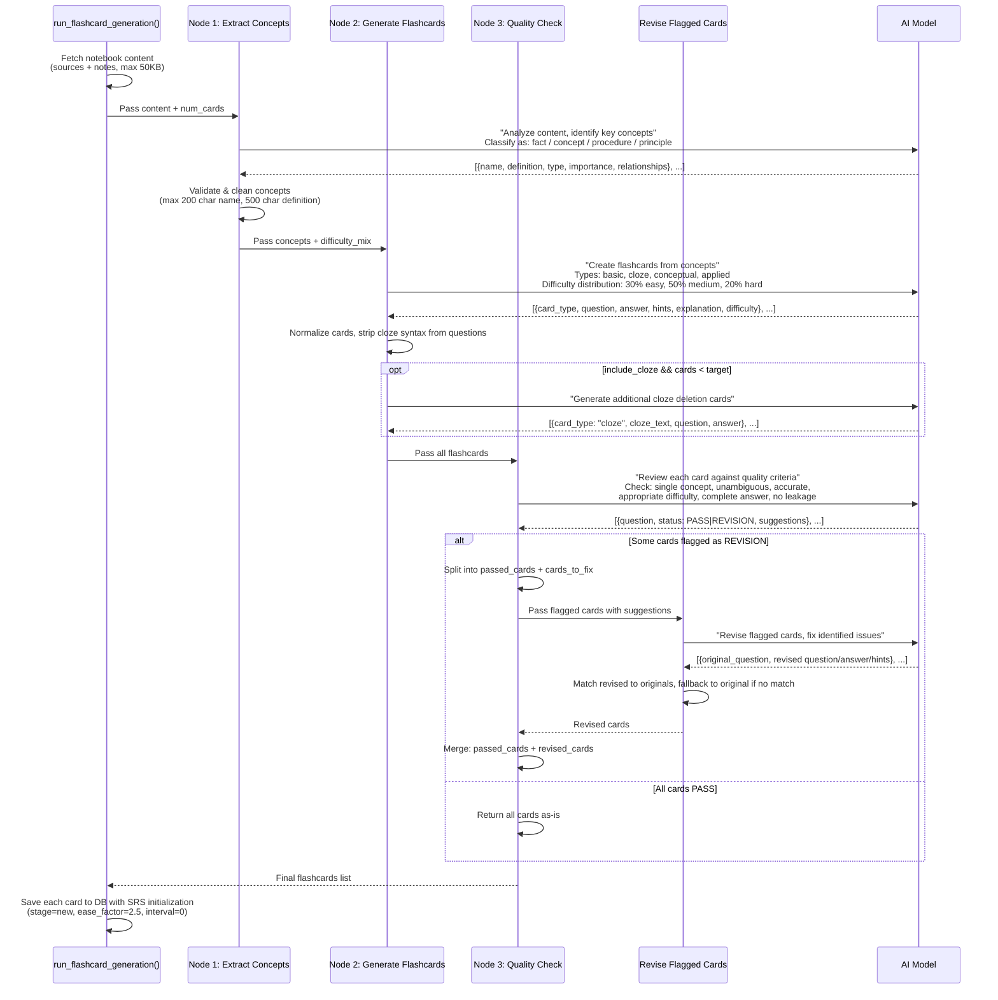
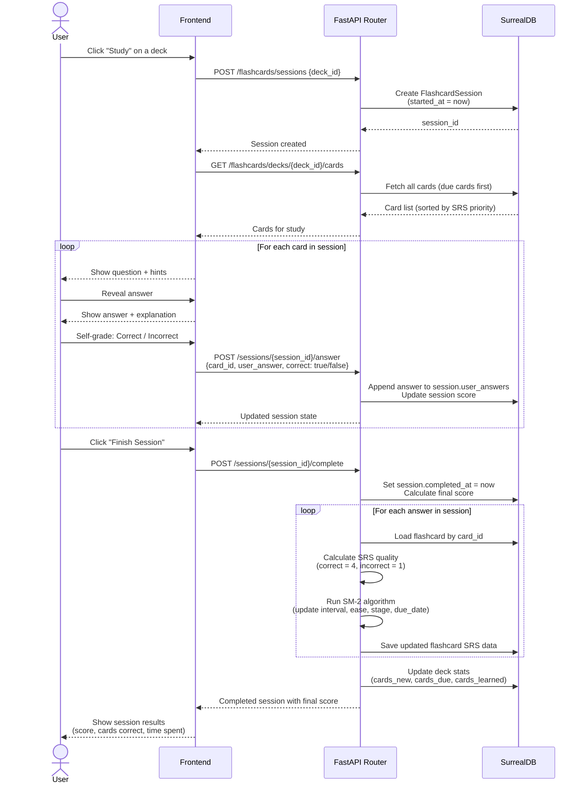
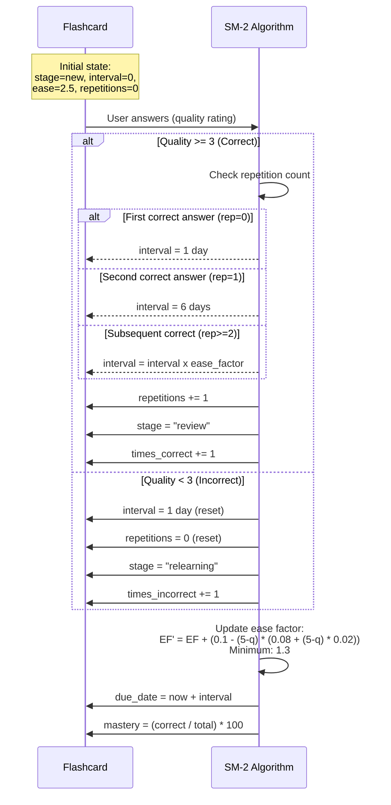
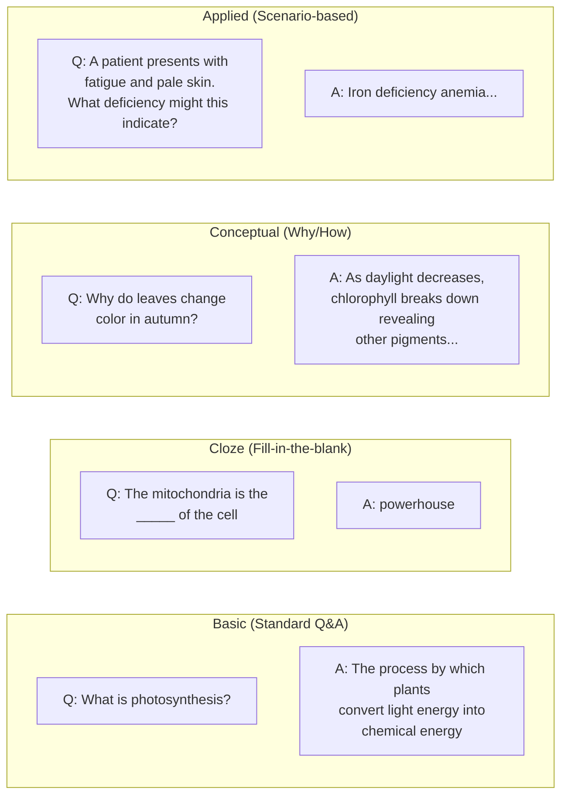
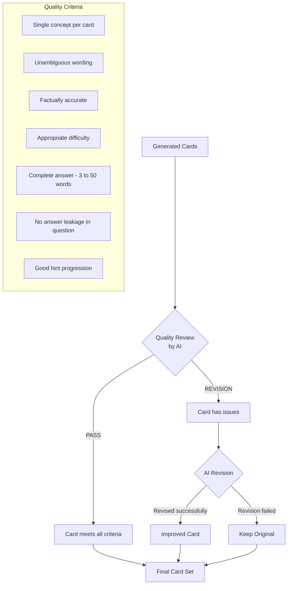

# Flashcards System - Technical Overview

## 1. High-Level Architecture

---

## 2. Data Model

---

## 3. Flashcard Generation Flow (End-to-End)

This is the main sequence: a user creates a deck and triggers AI generation from notebook content.

---

## 4. AI Generation Pipeline (LangGraph Detail)

The 4-step AI pipeline that transforms raw notebook content into quality-checked flashcards.

---

## 5. Study Session Flow

How a user studies flashcards and how the system tracks progress.

---

## 6. Spaced Repetition System (SM-2 Algorithm)

The SM-2 algorithm determines when each card should be reviewed next. This is the industry-standard algorithm used by tools like Anki.

### SM-2 in Practice: Example Card Lifecycle

| Review # | Answer  | Quality | Interval | Next Due     | Ease Factor | Stage      |
|----------|---------|---------|----------|--------------|-------------|------------|
| 1        | Correct | 4       | 1 day    | Tomorrow     | 2.50        | review     |
| 2        | Correct | 4       | 6 days   | Next week    | 2.50        | review     |
| 3        | Wrong   | 1       | 1 day    | Tomorrow     | 2.18        | relearning |
| 4        | Correct | 4       | 1 day    | Tomorrow     | 2.18        | review     |
| 5        | Correct | 4       | 6 days   | Next week    | 2.18        | review     |
| 6        | Correct | 4       | 13 days  | ~2 weeks     | 2.18        | review     |
| 7        | Correct | 4       | 28 days  | ~1 month     | 2.18        | review     |

Cards that are consistently answered correctly get shown less frequently (intervals grow). Wrong answers reset the cycle.

---

## 7. Card Types

The system generates four types of flashcards to engage different cognitive levels:

Each card also includes:
- **Hints** - Progressive clues (vague to specific) to help before revealing the answer
- **Explanation** - Why the answer is correct (shown after reveal)
- **Difficulty** - easy / medium / hard (distributed: 30% / 50% / 20%)
- **Tags** - For categorization and filtering

---

## 8. Quality Assurance Pipeline

Every generated card goes through automated quality review before being saved.

---

## 9. API Endpoints Reference

### Deck Management
| Method | Endpoint | Description |
|--------|----------|-------------|
| `GET` | `/flashcards/notebook/{notebook_id}/check` | Check if notebook has content for generation |
| `GET` | `/flashcards/decks` | List all decks (optional notebook filter) |
| `GET` | `/flashcards/decks/{deck_id}` | Get deck with statistics |
| `POST` | `/flashcards/decks` | Create new deck |
| `PUT` | `/flashcards/decks/{deck_id}` | Update deck metadata |
| `DELETE` | `/flashcards/decks/{deck_id}` | Delete deck and all cards |

### Card Generation & Management
| Method | Endpoint | Description |
|--------|----------|-------------|
| `POST` | `/flashcards/decks/{deck_id}/generate` | Submit async AI generation job |
| `GET` | `/flashcards/jobs/{job_id}` | Poll generation job status |
| `GET` | `/flashcards/decks/{deck_id}/cards` | Get all cards in deck |
| `POST` | `/flashcards/decks/{deck_id}/cards` | Add manual card |

### Study Sessions
| Method | Endpoint | Description |
|--------|----------|-------------|
| `POST` | `/flashcards/sessions` | Start new study session |
| `GET` | `/flashcards/sessions/{session_id}` | Get session details |
| `POST` | `/flashcards/sessions/{session_id}/answer` | Submit answer for a card |
| `POST` | `/flashcards/sessions/{session_id}/complete` | Complete session (triggers SRS updates) |
| `GET` | `/flashcards/sessions/deck/{deck_id}` | Get recent sessions |
| `GET` | `/flashcards/decks/{deck_id}/stats` | Get aggregate statistics |

---

## 10. Key Technical Decisions

| Decision | Choice | Why |
|----------|--------|-----|
| **SRS Algorithm** | SM-2 (SuperMemo 2) | Industry standard, proven effective, same as Anki |
| **AI Pipeline** | LangGraph state machine | Supports multi-step workflows with checkpointing |
| **Job Execution** | asyncio background tasks | Lightweight, no external queue needed |
| **Card Generation** | Concept extraction first | Better quality than direct Q&A generation from raw text |
| **Quality Gate** | AI-powered review + revision | Catches bad cards before they reach the user |
| **Content Limit** | 50KB max from notebook | Balances quality with LLM context window |
| **Frontend Polling** | GET /jobs/{id} polling | Simple, reliable for async generation status |
| **Database** | SurrealDB | Consistent with rest of application |

---

## 11. File Map

| File | Purpose |
|------|---------|
| `open_notebook/domain/flashcard.py` | Domain models: FlashcardDeck, Flashcard, FlashcardSession |
| `open_notebook/graphs/flashcards.py` | AI generation pipeline (LangGraph): concept extraction, card generation, QA |
| `api/flashcard_service.py` | Background job management for async generation |
| `api/routers/flashcards.py` | REST API endpoints |
| `frontend/src/lib/types/flashcards.ts` | TypeScript type definitions |
| `frontend/src/lib/api/flashcards.ts` | Frontend API client |
| `frontend/src/lib/hooks/use-flashcards.ts` | React Query hooks for data fetching |
| `frontend/src/app/(dashboard)/flashcards/` | UI pages (deck list, deck detail, study) |
| `prompts/flashcard/` | Jinja templates for AI prompts |
